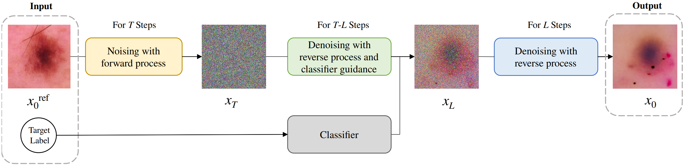

# InsMix

<!-- [[paper](https://arxiv.org/abs/1905.06696).] -->

This is the official code for "Class Aware Data Augmentation with Diffusion Model".

### Pipeline

### Requirements
matplotlib==3.4.3
numpy==1.20.3
Pillow==9.5.0
scikit_learn==1.2.2
torch==1.13.1
torchvision==0.9.0+cu111
tqdm==4.62.3

### Usage

### Citation
[ ] TO BE RELEASED.

### TODO
- [ ] 
- [ ] Refactor the code to make it more readable.

### Acknowledgment 